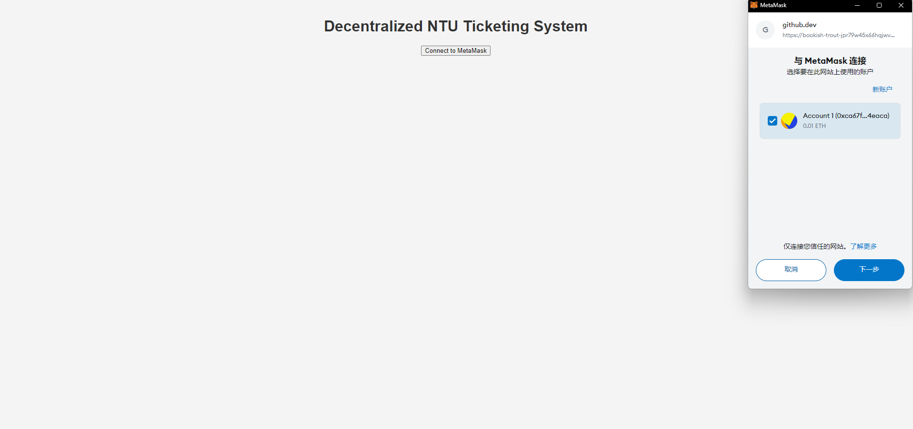
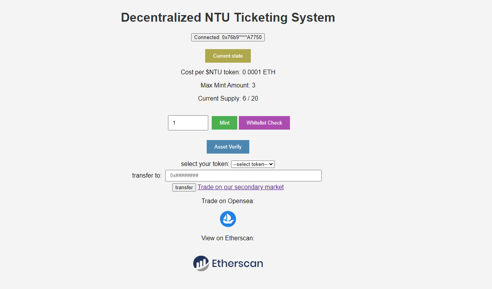
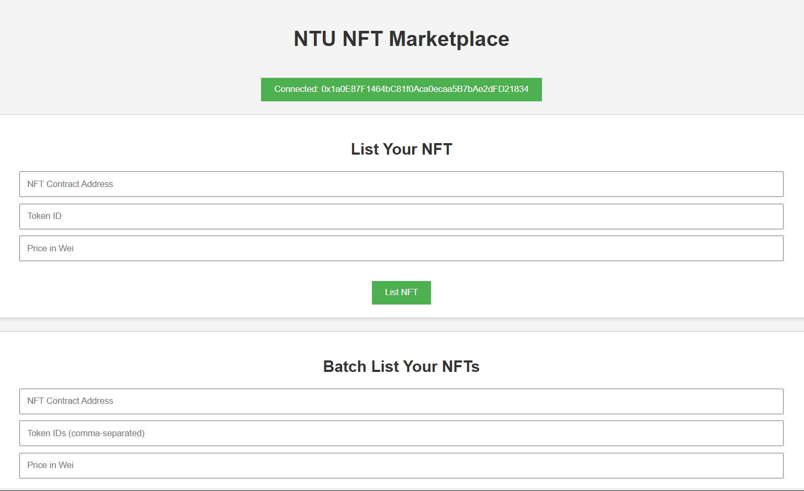
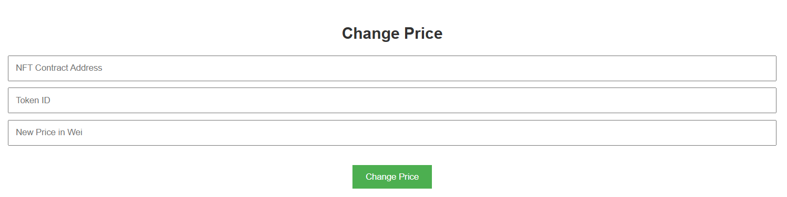
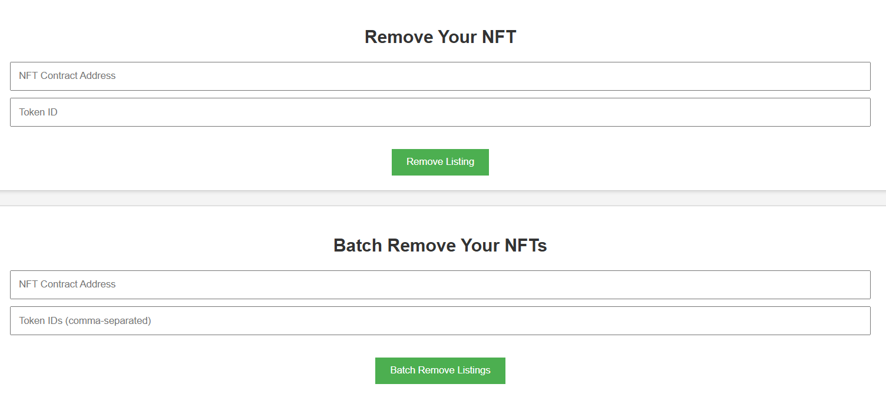
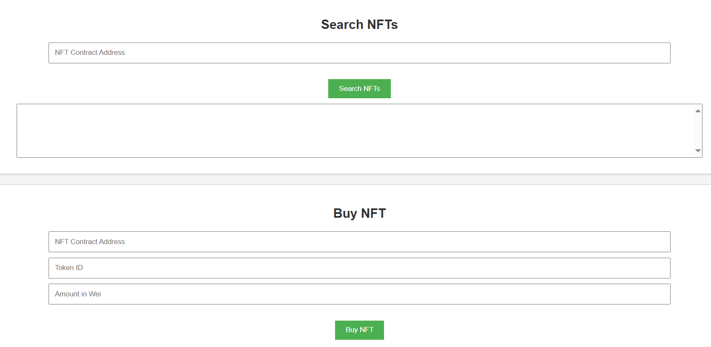

# Decentralized NTU Ticketing System

## 1. Project Proposal

This project is a decentralized ticketing system designed for university events. The system utilizes blockchain technology to issue tickets as NFTs, ensuring security and transparency in ticket sales and transfers. It addresses common problems like ticket fraud and scalping.

Main features:

- **NFT Tickets**: Each ticket is issued as a non-fungible token.
- **Pre-sale and Public-sale**: Supports phased ticket sales.
- **Ticket Validation**: Built-in verification system to confirm ticket authenticity.
- **Secondary Market**: Allows users to resell tickets securely.

## 2. Research and Literature Review

## 3. Technology and Tools

**Blockchain Platform:**

- Ethereum

**Dev Tools:**

- Front-end: *HTML, CSS*
- Back-end: *Python with Flask, Node.js*
- Smart Contract: *Solidity*

## 4. Prototype and Design

### 4.1 User Login

In the Decentralized NTU Ticketing System, users should only be allowed to login with wallet, which eliminates the need for traditional username/password.

A simple login page which link to metamask is required:



### 4.2 Primary Market

#### 4.2.1 NFT Minting (Purchasing)

When users purchase a ticket, the system mints an NFT representing the ticket on the blockchain. This ensures each ticket is unique, tamper-proof, and verifiable on-chain. Users can view their NFT tickets in their digital wallet.

Some key values should be clarified:

- **Max Supply**: Limit amount of ticket supply (modified only by owner)
- **Max mint amount per TXN**: Maximum quantity per transaction (modified only by owner)

#### (1) Pre-sale and Whitelist

This Pre-sale function is designed to allow only wallets on the whitelist to participate in the phase, ensuring exclusive access. Whitelisted users can claim the items for free during the presale period.

The key properties include:

- **Whitelist Management**: Admins can add or remove wallet addresses from the whitelist.
- **Presale Duration**: Configurable with either block numbers or timestamps to define the presale window.
- **Whitelist Check**: Users' wallet addresses are checked against the whitelist before they can proceed.

This ensures controlled, secure access during pre-sales.

#### (2) Public-sale

The public-sale phase is designed to allow unrestricted access to all users once the pre-sale ends. Tickets are available at a set Price Per Token. This ensures equal opportunities for all participants in the public sale phase.

#### 4.2.2 Asset Verify (Ticket Verify)

Asset Verify is required to ensure that each ticket (NFT) is legitimate, belongs to the user. Users are allowed to check all the assets available. The function also ensures the ticket hasn’t been used or transferred improperly, preventing fraudulent entries.

- **Transferability**: Users can transfer their tokens to other wallets through secure blockchain transactions. Ownership updates in real-time.

Here is a front-page structure of the primary market after log in:


### 4.3 Secondary market

#### 4.3.1 List ticket for sale/Approve/Set price

Secondary market allows users to trade NFTs, main features include:

- List ticket for sale
- Approve/Set price
- Batch list
- Delist revoke
- Buy ticket
- Transfer

A front-end page for seller should cover the functions below: List, Batch-list, Remove, Batch-remove and Change price





For buyers, search and purchase is needed:


## 5. Development

### 5.1 Smart Contract

To handle ticket issuance, transfers, and validations, the key step is to develop and deploy smart contracts.We separate the develop phase into two modules:primary market and secondary market.

The system is fundamentally structured around the ERC-721 standard, which serves as the core framework for its operations. This standard provides the essential functionalities and interfaces required for the management and exchange of NFTs, ensuring that each token is unique and traceable. By leveraging the ERC-721 standard, the secondary market facilitates secure and efficient trading of NFTs, enabling users to list, buy, sell, and transfer ownership of these digital assets within a standardized and interoperable ecosystem.

Here is the core function for the primary market:

```
    // public
    function mint(address _to, uint256 _mintAmount) public payable {
        uint256 supply = totalSupply();
        bool Presale = check_presale();
        require(_mintAmount > 0);
        require(_mintAmount <= maxMintAmount);
        require(supply + _mintAmount <= maxSupply);
        if (msg.sender != owner()) {
            if(whitelisted[msg.sender] != true) {
                require(!Presale, "Please wait for public sale!");
                require(msg.value >= cost * _mintAmount);
            }
        }

        for (uint256 i = 0; i < _mintAmount; i++) {
            _safeMint(_to, supply + i);
        }
    }

    function walletOfOwner(address _owner) public view returns (uint256[] memory){
        uint256 ownerTokenCount = balanceOf(_owner);
        uint256[] memory tokenIds = new uint256[](ownerTokenCount);
        for (uint256 i; i < ownerTokenCount; i++) {
            tokenIds[i] = tokenOfOwnerByIndex(_owner, i);
        }
        return tokenIds;
    }

    function verifyAsset(address _owner) public view returns (bool){
        bool isOwner = true;
        if(balanceOf(_owner)>0){
            return isOwner;
        }
        return !isOwner;
    }
```

The core function of the secondary market implemented as below:

```
    //define the order properties of each NFT
    struct Order {
        address owner;
        uint256 price;
    }

    //Buyer buys NFT, the contract is nft_add, token_id is token_id, ETH is required when calling the function
    function purchase(address nft_add, uint256 token_id) public payable {
        Order storage order = nft_order[nft_add][token_id]; 
        require(order.price >= 0, "The price must be greater than or equal to 0"); 
        require(msg.value >= order.price, "Need more ether"); 

        IERC721 nft = IERC721(nft_add);
        require(nft.ownerOf(token_id) == address(this), "Invalid order"); 

        //transfer the NFT to the buyer
        nft.safeTransferFrom(address(this), msg.sender, token_id);
        //transfer ETH to the seller and refund the excess ETH to the buyer
        payable(order.owner).transfer(order.price);
        payable(msg.sender).transfer(msg.value - order.price);

        delete nft_order[nft_add][token_id]; 

        emit Purchase(msg.sender, nft_add, token_id, order.price);
    }

```

### 5.2 Front-end Development

### 5.3 Back-end Development

### 5.4 Test and Deploy

At first we test our system through local **http-server** for convenience

## 6. Ethical Considerations and Compliance

### 6.1 Data Privacy

Sensitive Data Handling: Ensure that personal information of users, such as names and payment details, is encrypted and stored securely. Use pseudonymous identifiers where possible to protect user identities.

### 6.2 Smart Contract Security

Regularly audit smart contracts to identify and fix potential vulnerabilities or bugs. Ensure that contracts operate as intended and do not expose user data to unnecessary risks.

Design smart contracts to prioritize user security and fairness. Avoid any mechanisms that could exploit or disadvantage users.

### 6.3 Ethical Research Approval

Obtain necessary approvals from the NTU ethics review board before initiating the project. Ensure that the project aligns with the university's ethical research standards.

### 6.4 Smart Contract Legality

Ensure that smart contracts and blockchain transactions comply with Singapore laws, including those related to financial transactions and consumer protection.

By addressing these ethical considerations and ensuring compliance with relevant guidelines, the decentralized ticketing system can operate responsibly and uphold high standards of integrity and user trust.
